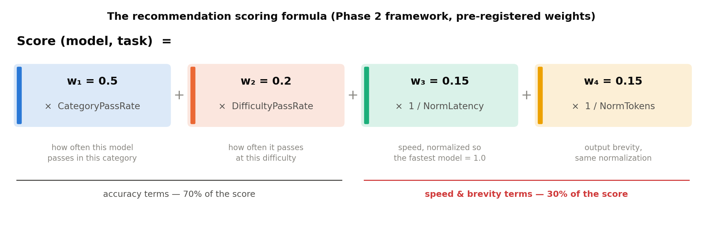
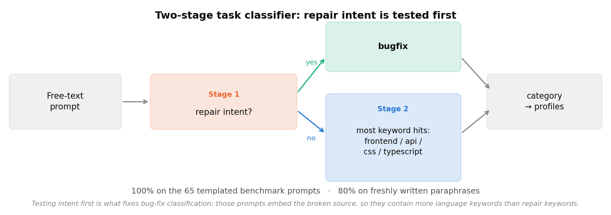
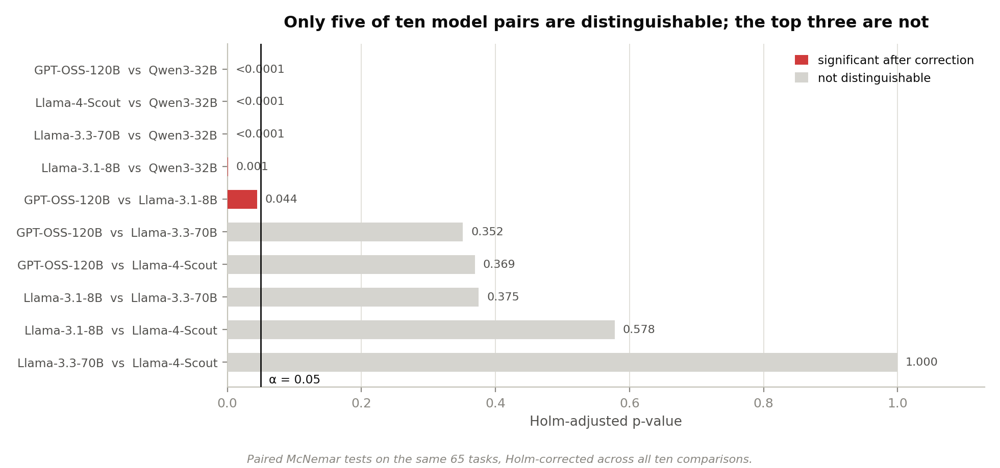
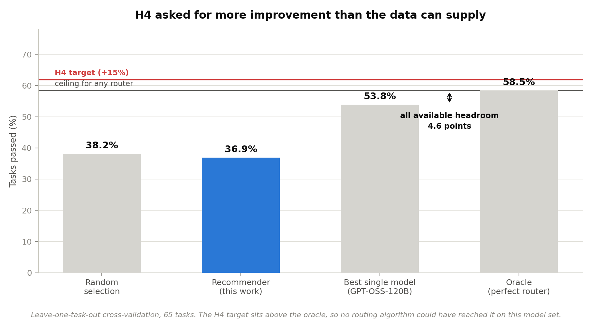
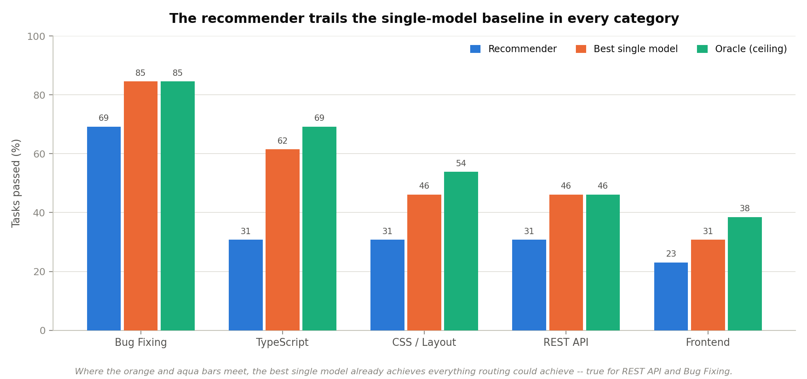
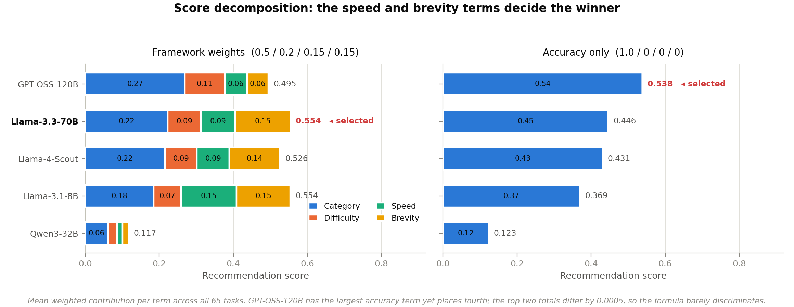
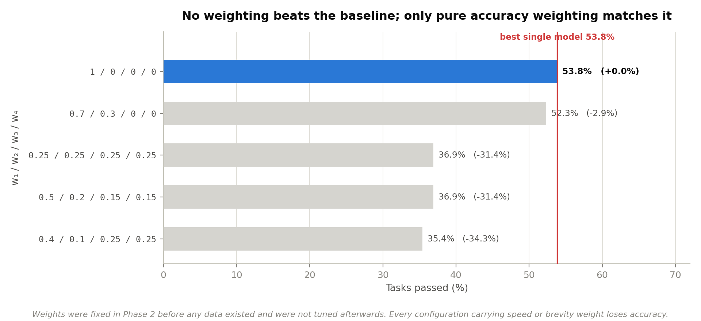
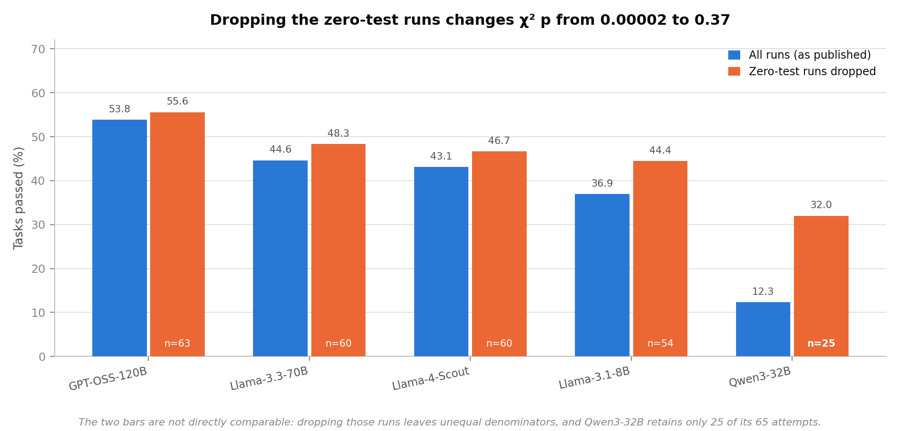
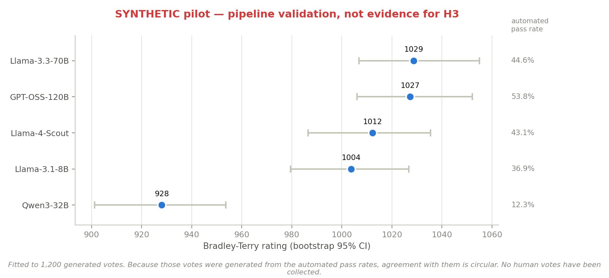

# Research Progress Report — Phases 6 and 7

**Multi-LLM Comparison Platform: Comparative Evaluation of Code-Generation LLMs Across Web Development Task Categories**

**Student:** Venu Dattathreya Vemuru (811776500)
**Course:** CSCI 7200 — Master's Project
**Report period:** May–July 2026
**GitHub:** https://github.com/venu284/LLM_Comparison.git

---

## 1. Executive Summary

This report covers Phase 6 (Analysis and Recommendation Algorithm) and Phase 7
(Human Evaluation) of the Master's project. Phase 6 is complete. Phase 7 is
fully instrumented and its protocol is finalized, but no human votes have been
collected, so H3 remains untested.

Phase 6 required no new API calls. Every statistic and the entire recommendation
algorithm were computed offline from the 325 evaluation runs collected in Phase
5. Before any new analysis was run, the published Phase 5 pass rates were
re-derived from the stored data and reproduce exactly.

The phase produced four substantive results, three of which qualify conclusions
drawn in the Phase 5 report.

**First, H4 is rejected, and was arithmetically unreachable.** The hypothesis
predicted that task-aware routing would improve pass rate by more than 15% over
a single-model strategy. Under leave-one-task-out cross-validation the oracle
ceiling — a perfect router that always picks a model that passes — reaches only
58.5%, while always choosing GPT-OSS-120B already reaches 53.8%. The maximum
improvement available to *any* routing algorithm on this dataset is therefore
+8.6%, well below the 15% H4 required. Only three of 65 tasks are solvable by
some model but not by GPT-OSS-120B.

**Second, the recommendation algorithm as specified underperforms its own
baseline**, scoring 36.9% against 53.8% for always-best-single (−31.4%,
bootstrap 95% CI [−27.7, −7.7] percentage points, p = 0.0004). This is a
calibration failure, not an implementation failure: the Phase 2 framework fixed
30% of the scoring weight on latency and token efficiency before any data
existed, which on this data steers selection toward fast, terse models and away
from accurate ones. Removing those terms recovers performance to 53.8%, exactly
tying the baseline.

**Third, the Phase 5 model ranking does not survive statistical testing.**
Pairwise McNemar tests with Holm correction show GPT-OSS-120B is *not*
distinguishable from Llama-3.3-70B (p = 0.35) or Llama-4-Scout (p = 0.37). The
headline "GPT-OSS-120B achieved the highest overall pass rate" holds as a point
estimate but not as a ranking claim.

**Fourth, category-level specialization is weaker than reported.** Of the five
per-category tests supporting RQ1, only Bug Fixing reaches significance
(p = 0.002). Frontend, API, CSS, and TypeScript do not, at 65 observations each.

Phase 7 instrumentation — a blind pairwise voting interface, a Bradley-Terry
estimator, and a synthetic-vote generator — is built and validated. The
estimator recovers planted model strengths to within 0.003. A synthetic pilot of
1,200 votes was used to derive an evidence-based sample size for the human study
(minimum 300 votes, target 800). These synthetic results validate the machinery
only and are not evidence for H3.

---

## 2. Work Completed

### 2.1 Analysis Module (Phase 6 — Complete)

A new module, `pipeline/analysis/`, was built with five components:

| File | Purpose |
|---|---|
| `data.py` | Single loading path for Phase 5 results; PostgreSQL with CSV fallback |
| `stats.py` | Chi-squared, Cramér's V, Spearman, McNemar, Holm correction |
| `recommender.py` | Two-stage task classifier and weighted scoring algorithm |
| `validate.py` | Leave-one-task-out cross-validation against three baselines |
| `run_analysis.py` | Orchestrator; writes JSON results and charts |

All analyses run from one command (`python analysis/run_analysis.py`) and write
machine-readable output to `pipeline/exports/analysis/phase6_results.json`, so
every number in this report is generated rather than transcribed.

**Test selection.** Because every model attempts the same 65 tasks, model-versus-model
comparisons are *paired*. McNemar's test is therefore correct and a two-sample
proportion test is not. This distinction matters: it is the reason the
GPT-OSS-120B advantage over Llama-3.3-70B fails to reach significance.

### 2.2 Recommendation Algorithm (Phase 6 — Complete)

The algorithm implements the formula fixed in the Phase 2 framework:

```
Score(model, task) = w1·CategoryPassRate + w2·DifficultyPassRate
                   + w3·(1/NormalizedLatency) + w4·(1/NormalizedTokens)
```

with the pre-registered defaults w1 = 0.5, w2 = 0.2, w3 = 0.15, w4 = 0.15.
Latency and token terms are normalized by dividing by the best value across
models, so the fastest model scores 1.0 and the terms are unit-free.



**Figure 1.** The scoring formula and its four weighted terms. Seventy percent of
the score rewards accuracy and thirty percent rewards speed and brevity — a
split fixed in Phase 2 before any data existed. Section 3.6 shows that this
split is what makes the algorithm underperform.

**Stage 1 — task classification.** Rule-based keyword matching. An early version
counted keyword hits across all five categories at once and classified only 8%
of bug-fix tasks correctly: a bug-fix prompt embeds the broken React or Express
source, so it necessarily contains more language keywords than repair keywords.
Bug fixing is an *intent*, orthogonal to language, so the classifier now tests
repair intent first and lets it decide on its own; language categories compete
only when repair intent is absent. This raised accuracy from 81.5% to 100% on
the 65 benchmark prompts.

**Stage 2 — profile lookup and scoring.** Per-model empirical profiles built
from training data only, then scored and ranked.



**Figure 2.** The two-stage classifier. Testing repair intent before language
keywords is what lifts bug-fix classification from 8% to 100%.

### 2.3 Validation Design (Phase 6 — Complete)

Leave-one-task-out cross-validation over all 65 tasks. For each fold, model
profiles are rebuilt from the other 64 tasks; the held-out task never
contributes to the profiles used to choose a model for it. An explicit assertion
enforces this. The always-best-single baseline is likewise refitted per fold, so
it enjoys no information advantage over the recommender.

Three baselines, as specified in the framework: random (exact expectation rather
than sampled), always-best-overall, and oracle.

### 2.4 Human Evaluation Instrumentation (Phase 7 — Built, Not Yet Run)

A new top-level module, `human_eval/`:

| File | Purpose |
|---|---|
| `app.py` | Blind side-by-side voting interface |
| `bradley_terry.py` | Maximum-likelihood Bradley-Terry fit with bootstrap intervals |
| `synthetic_votes.py` | Vote generator for pipeline validation |
| `run_synthetic.py` | End-to-end runner |
| `db.py` | Database access for the existing `human_votes` table |
| `PROTOCOL.md` | Full human evaluation methodology |

No schema change was needed; the `human_votes` table has been in
`db/schema.sql` since Phase 4.

**Blinding.** Model identity is never sent to the browser. The server maps an
opaque comparison id to the two models and resolves it only when the vote is
posted, so identity cannot be read from the page source. Left/right assignment
is randomized per comparison.

**Implementation note.** The Phase 2 framework named FastAPI for the backend.
The voting interface is built on the Python standard library instead. It is a
research instrument used by a handful of evaluators, not the Phase 8
demonstration application, and removing the dependency removes an install step
from every participant's setup. The only third-party import is psycopg2, already
a pipeline dependency.

---

## 3. Results

### 3.1 Overall Model Differences (RQ1)

Model identity is associated with outcome across all 325 runs:

| Test | Statistic | p | Cramér's V |
|---|---|---|---|
| Model × outcome (all tasks) | χ²(4) = 27.04 | 1.9 × 10⁻⁵ | 0.288 |
| Difficulty × outcome (pooled) | χ²(2) = 86.06 | 2.1 × 10⁻¹⁹ | 0.515 |

**Difficulty is a substantially stronger driver of outcome than model choice**
(V = 0.515 against 0.288). Which model you use matters less than how hard the
task is.

### 3.2 Per-Category Differences (RQ1)

| Category | χ²(4) | p | Cramér's V | Min expected count |
|---|---|---|---|---|
| Bug Fixing | 16.78 | **0.0021** | 0.508 | 4.80 |
| TypeScript | 8.85 | 0.065 | 0.369 | 4.80 |
| API | 7.74 | 0.102 | 0.345 | 3.80 |
| Frontend | 3.65 | 0.456 | 0.237 | 3.20 |
| CSS | 0.93 | 0.921 | 0.119 | 4.80 |

Only Bug Fixing reaches significance. Every subtable has a minimum expected
count below 5, so the chi-squared approximation is strained throughout and these
p-values should be read as indicative.

This is a **weaker basis for RQ1 than the Phase 5 report claimed.** Category
specialization is visible in the point estimates, but at 65 observations per
category only the Bug Fixing effect is statistically distinguishable from noise.

### 3.3 Pairwise Model Comparisons (McNemar, Holm-corrected)

| Model A | Model B | A only | B only | p (Holm) | Significant |
|---|---|---:|---:|---:|---|
| GPT-OSS-120B | Qwen3-32B | 28 | 1 | < 0.0001 | **yes** |
| Llama-3.3-70B | Qwen3-32B | 22 | 1 | < 0.0001 | **yes** |
| Llama-4-Scout | Qwen3-32B | 20 | 0 | < 0.0001 | **yes** |
| Llama-3.1-8B | Qwen3-32B | 17 | 1 | 0.0010 | **yes** |
| GPT-OSS-120B | Llama-3.1-8B | 13 | 2 | 0.0443 | **yes** |
| GPT-OSS-120B | Llama-3.3-70B | 7 | 1 | 0.3516 | no |
| GPT-OSS-120B | Llama-4-Scout | 10 | 3 | 0.3691 | no |
| Llama-3.1-8B | Llama-3.3-70B | 1 | 6 | 0.3750 | no |
| Llama-3.1-8B | Llama-4-Scout | 2 | 6 | 0.5781 | no |
| Llama-3.3-70B | Llama-4-Scout | 5 | 4 | 1.0000 | no |



**Figure 3.** Holm-adjusted p-values for all ten pairwise comparisons.

Five of ten pairs are significant, and four of those five involve Qwen3-32B.
**The top three models are statistically indistinguishable from one another.**

### 3.4 Parameter Count and Performance (RQ2)

Spearman ρ = 0.70 between active parameter count and overall pass rate
(p = 0.19, n = 5). The direction matches expectation — larger models perform
better — but with five models this is descriptive only and cannot support an
inferential claim.

### 3.5 Task Classifier

100% accuracy on all 65 benchmark prompts, with no misclassifications.

That figure is optimistic. Benchmark prompts share a rigid template
("BUG DESCRIPTION:", "Fix the bug in the following code"), which the classifier
matches easily. Tested on ten freshly written paraphrases in natural developer
phrasing, accuracy was **80%**. Both failures were bug reports lacking any
explicit repair verb — "the submit handler fires twice on every click, sort it
out" and "users report the cart total is off by one cent sometimes". Realistic
classifier accuracy is therefore closer to 80% than 100%. Both figures are shown
on Figure 2.

### 3.6 Recommendation Algorithm Validation (RQ3, H4)

Leave-one-task-out over 65 tasks:

| Strategy | Pass rate |
|---|---:|
| Oracle (upper bound) | 58.5% |
| Always best single model (GPT-OSS-120B) | 53.8% |
| Random selection | 38.2% |
| **Recommender (framework weights)** | **36.9%** |

Improvement over best single model: **−31.4%**. Bootstrap 95% CI on the
difference: [−27.7, −7.7] percentage points, p = 0.0004. **H4 is not supported.**



**Figure 4.** The four strategies under leave-one-task-out cross-validation. The
red rule marks the level H4 required; it sits *above* the oracle, so no routing
algorithm could have reached it on this model set.

**The headroom result is the more important finding.** Oracle 58.5% against
best-single 53.8% means the maximum improvement available to any router is
**+8.6%**. H4 required more than +15%. The hypothesis was unreachable on this
dataset regardless of algorithm design, because 35 of the 38 tasks solvable by
any model are already solved by GPT-OSS-120B. Only **three tasks in the entire
benchmark** are winnable exclusively by routing elsewhere.

Per category:

| Category | Recommender | Best single | Random | Oracle |
|---|---:|---:|---:|---:|
| Bug Fixing | 69.2% | 84.6% | 63.1% | 84.6% |
| TypeScript | 30.8% | 61.5% | 36.9% | 69.2% |
| API | 30.8% | 46.2% | 29.2% | 46.2% |
| CSS | 30.8% | 46.2% | 36.9% | 53.8% |
| Frontend | 23.1% | 30.8% | 24.6% | 38.5% |



**Figure 5.** Where the best-single and oracle bars are equal — REST API and Bug
Fixing — a single model already achieves everything routing could achieve.

#### Why the algorithm selects the wrong model

Decomposing the score into its four weighted terms shows where the loss comes
from. GPT-OSS-120B contributes the largest accuracy term of any model and still
places fourth on total score, because it is the slowest and most verbose of the
four competitive models.



**Figure 6.** Mean weighted contribution per term across all 65 tasks. Under the
framework weights (left) the speed and brevity terms decide the outcome and a
mid-tier model is selected; removing them (right) selects the most accurate
model. The top two totals on the left differ by 0.0005, so the formula barely
discriminates between them.

### 3.7 Weight Sensitivity

| w1 (cat) | w2 (diff) | w3 (lat) | w4 (tok) | Recommender | vs baseline |
|---:|---:|---:|---:|---:|---:|
| 0.50 | 0.20 | 0.15 | 0.15 | 36.9% | −31.4% |
| **1.00** | **0.00** | **0.00** | **0.00** | **53.8%** | **0.0%** |
| 0.70 | 0.30 | 0.00 | 0.00 | 52.3% | −2.9% |
| 0.40 | 0.10 | 0.25 | 0.25 | 35.4% | −34.3% |
| 0.25 | 0.25 | 0.25 | 0.25 | 36.9% | −31.4% |

The result is driven entirely by the speed and efficiency terms. Any weighting
that includes them underperforms; pure category weighting ties the baseline. No
weighting tested beats it.



**Figure 7.** Every weighting tested against the single-model baseline. Only pure
category weighting reaches it, and none exceeds it.

The weights were fixed in Phase 2 before data existed, and they were not tuned
after the fact to rescue H4. This table is reported as a sensitivity analysis,
not as a search for a passing configuration.

### 3.8 Zero-Test Sensitivity

Phase 5 scored 63 of 325 runs as failures despite the Docker harness reporting
no test count at all. Re-running the analysis with those runs excluded:

| Treatment | n | Overall χ² p | Cramér's V |
|---|---:|---:|---:|
| All runs (as published) | 325 | 1.9 × 10⁻⁵ | 0.288 |
| Zero-test runs dropped | 262 | 0.369 | 0.128 |

**The overall model effect loses significance under the alternative treatment.**

This must be read carefully in both directions. Dropping those runs removes 40
of Qwen3-32B's 65 attempts, leaving badly unequal denominators:

| Model | Passes / attempts (filtered) | Rate |
|---|---:|---:|
| GPT-OSS-120B | 35 / 63 | 55.6% |
| Llama-3.3-70B | 29 / 60 | 48.3% |
| Llama-4-Scout | 28 / 60 | 46.7% |
| Llama-3.1-8B | 24 / 54 | 44.4% |
| Qwen3-32B | 8 / 25 | 32.0% |



**Figure 8.** Pass rates under both treatments, with the surviving attempt count
printed inside each orange bar. Qwen3-32B retains only 25 of its 65 attempts.

So the p-value moved partly because the association genuinely weakened and
partly because most of one arm's data was deleted. **Neither treatment is
correct.** Scoring a harness failure as a model failure is wrong when the
harness was at fault; dropping it is wrong when the model emitted code so broken
that no test could run. The honest conclusion is that the published Phase 5
result is **not robust to a defensible alternative treatment**, and resolving
this requires the failure taxonomy that `failure_mode` was designed to capture
but never recorded.

Because the filtered dataset is no longer a complete task × model grid, paired
statistics on it are undefined. McNemar and the LOOCV validation refuse to run
against it rather than silently treating missing cells as failures.

### 3.9 Phase 7 Synthetic Pilot

**These results are synthetic. They validate the pipeline and are not evidence
for H3.**

Bradley-Terry fitted to 1,200 generated votes converged in 20 iterations:

| Model | Rating | 95% CI | Automated pass rate |
|---|---:|---|---:|
| Llama-3.3-70B | 1028.7 | [1007, 1055] | 44.6% |
| GPT-OSS-120B | 1027.2 | [1006, 1052] | 53.8% |
| Llama-4-Scout | 1012.2 | [986, 1035] | 43.1% |
| Llama-3.1-8B | 1003.7 | [980, 1027] | 36.9% |
| Qwen3-32B | 928.1 | [901, 954] | 12.3% |



**Figure 9.** Fitted ratings with bootstrap 95% intervals, beside each model's
automated pass rate. Every interval except Qwen3-32B's overlaps at least one
other, which is the expected shape at this vote count. **Synthetic data.**

Estimator check: Spearman ρ = 1.000 between fitted ratings and observed win
rates, confirming the fit reproduces the ordering in the votes it was given.
Independently, the estimator recovers planted strengths from a known generating
distribution to within 0.003.

Correlation between simulated preference and automated pass rate is ρ = 0.90.
This is the exact computation H3 calls for, but on synthetic votes it is
circular — the votes were generated from those same pass rates. It is shown to
demonstrate that the H3 machinery runs, nothing more.

The pilot also produced an evidence-based sample size for the human study
(Section 4 of `human_eval/PROTOCOL.md`): 300 votes minimum to separate the
extremes reliably, 800 for roughly ±30 rating points per model.

---

## 4. Findings

1. **H4 is rejected, and was unreachable by construction.** Maximum available
   improvement from perfect routing is +8.6% against the +15% required. Only 3
   of 65 tasks are winnable by routing away from the single best model. Any
   future routing hypothesis must first establish that headroom exists.

2. **Routing headroom requires model complementarity, which this model set
   lacks.** GPT-OSS-120B solves 35 of the 38 tasks any model solves. Routing pays
   off only when different models succeed on *different* tasks; here their
   successes are nearly nested. A future model set should be selected for
   complementarity, not only for architectural diversity.

3. **Pre-registered weights were miscalibrated for this regime.** Spending 30% of
   the score on latency and token efficiency costs 17 percentage points of
   accuracy. Efficiency terms make sense when accuracy is comparable across
   models; here the accuracy spread is large enough to dominate.

4. **The Phase 5 ranking is a ranking of point estimates, not of models.** The
   top three models are statistically indistinguishable. Only the Qwen3-32B
   deficit and the GPT-OSS-120B advantage over Llama-3.1-8B survive correction
   for multiple comparisons.

5. **Difficulty dominates model choice.** Cramér's V of 0.515 for difficulty
   against 0.288 for model. For a practitioner, task complexity predicts success
   better than model selection does.

6. **Nineteen percent of the Phase 5 dataset rests on an unresolved scoring
   decision.** The overall model effect is significant under the published
   treatment and not significant under a defensible alternative. This is the most
   consequential outstanding issue in the project.

7. **Rule-based task classification is brittle.** 100% on templated benchmark
   prompts, 80% on natural paraphrases, with both failures on bug reports lacking
   explicit repair verbs. A learned classifier is the appropriate Phase 8 upgrade.

---

## 5. Challenges and Design Decisions

1. **Bug-fix classification collapse.** The initial single-pass keyword
   classifier scored 8% on bug-fix tasks because bug-fix prompts embed source
   code in the language of another category. Resolved by treating repair intent
   as orthogonal to language and testing it first. A false-positive audit against
   all 65 prompts then removed two over-broad markers ("debug" alone, which fires
   on a TypeScript prompt merely mentioning debugging, and "instead of", which
   fires on a design prompt).

2. **A silent pandas defect in contingency-table construction.** Selecting
   columns with `table[[False, True]]` on a table with boolean column labels is
   interpreted by pandas as a boolean *row* mask, not column selection, and
   silently returned a single-row table. Caught by a sanity check asserting that
   a table with no association yields p ≈ 1. Fixed by using explicit `reindex`.
   The episode is the reason every statistical function is now validated against
   distributions with known answers before being run on real data.

3. **NaN coercion inflating the oracle.** On the filtered dataset the task ×
   model grid becomes ragged, and calling `.astype(bool)` on the pivot turned
   every missing cell into `True`, inflating the oracle bound from 38/63 to
   56/63 and corrupting the first zero-test sensitivity figures. Fixed by filling
   explicitly and by adding guards that refuse to compute paired statistics on an
   incomplete grid.

4. **Synthetic preference model over-weighted concision.** The first generator
   applied a concision tiebreak whenever both models passed or both failed. Since
   most task/model pairs fail, that tiebreak decided the majority of comparisons
   and ranked the most accurate model fourth. The weight was reduced and split
   (0.15 when both pass, 0.05 when both fail) on the reasoning that two broken
   solutions give a reviewer very little to judge. The accompanying validation
   check was also corrected: it compared fitted ratings against *pass rates*,
   which conflates whether the estimator works with whether the generator agrees
   with pass rate. It now compares against the empirical win rates in the
   generated votes.

5. **Framework deviation on the web stack.** FastAPI was specified but is not
   installed in the project environment, and adding it would modify the
   environment for a component that does not need it. The voting interface uses
   the standard library instead.

---

## 6. Current Status and Next Steps

| # | Phase | Period | Status | Output |
|---|---|---|---|---|
| 1 | Literature Review | Feb–Mar 2026 | Complete | 16 sources |
| 2 | Framework Design | Mar–Apr 2026 | Complete | v2.0 doc |
| 3 | Build Benchmark Suite | Apr 2026 | Complete | 65 tasks |
| 4 | Build Evaluation Pipeline | Apr 2026 | Complete | 7 components |
| 5 | Run Experiments (Run 1) | Apr 2026 | Complete | 325 data points |
| 6 | Analysis & Algorithm | May–Jul 2026 | **Complete** | 5 modules, H4 tested |
| 7 | Human Evaluation | Jul 2026 – | **Instrumented; collection pending** | Protocol + tooling |
| 8 | Build Application | Aug 2026 | Planned | |
| 9 | Thesis & Defense | Aug–Sep 2026 | Planned | |

### Immediate next steps

1. **Recruit evaluators and collect human votes.** Everything needed is built.
   Target 800 votes from 8–12 evaluators. Synthetic votes must be cleared first
   (`python run_synthetic.py --clear`).

2. **Resolve the zero-test rows.** This now blocks a clean thesis claim. Two
   parts: confirm whether API-013 and CSS-012 are defective tasks by running them
   against their reference solutions in Docker, and populate `failure_mode` so
   harness failures can be separated from model failures.

3. **Re-run Qwen3-32B at a higher token limit.** Thirteen of its 65 runs hit the
   4,096-token ceiling and ten of those produced no test count. Until this is
   separated, the Phase 5 conclusion that chain-of-thought reasoning degrades
   code generation is confounded with simple output truncation.

4. **Pass@3 runs**, subject to Groq's 100K tokens/day/model limit. Single-run
   evaluation remains the largest threat to every result in this report.

5. **Reconsider the routing question for Phase 8.** Given +8.6% headroom, a
   demonstration application framed around "which model should I use" has little
   to demonstrate. Two better framings: select a model set chosen for
   complementarity, or reframe the application around *difficulty-aware*
   selection, since difficulty is the stronger signal.

---

## 7. Threats to Validity

**Carried forward from Phase 5:** single-run evaluation (Pass@1 only), model
substitution relative to the original framework, single inference provider
(Groq LPU), fixed temperature 0.2, and benchmark scope of 65 tasks across five
categories.

**New to this phase:**

- **Zero-test treatment.** The central RQ1 result is significant under the
  published treatment and not significant when the 63 zero-test runs are
  dropped. Unresolved, and the most serious threat in the project.

- **Statistical power.** At 65 observations per category, only a large effect is
  detectable. The four non-significant category results are consistent with
  genuine specialization that this sample cannot resolve; absence of evidence is
  not evidence of absence.

- **Chi-squared assumptions.** Every per-category subtable has a minimum expected
  count below 5. Those p-values are indicative rather than exact.

- **n = 5 models.** The Spearman correlation between parameter count and pass
  rate, and the eventual H3 correlation, both rest on five points.

- **Validation is within-benchmark.** LOOCV holds out tasks but not the
  benchmark. Estimated recommender performance would not transfer to tasks drawn
  from a different distribution.

- **Classifier accuracy is overstated by the benchmark.** 100% on templated
  prompts against 80% on natural paraphrases; the deployed figure is the latter.

- **Synthetic votes are not human data.** No claim in this report about human
  preference is supported by evidence. H3 is untested.

---

## 8. Reproducing These Results

```bash
cd pipeline
source venv/bin/activate
python analysis/run_analysis.py          # all Phase 6 statistics and charts

cd ../human_eval
python run_synthetic.py                  # Phase 7 pipeline validation
python app.py --port 8000                # voting interface
```

Outputs are written to `pipeline/exports/analysis/phase6_results.json`,
`pipeline/exports/analysis/phase7_synthetic.json`, and
`pipeline/exports/charts/phase6_*.png`. These paths are git-ignored, which is
why every figure in this report is reproduced inline.

---

## 9. References

[1] K. Xu et al., "Web-Bench: A LLM Code Benchmark Based on Web Standards and Frameworks," arXiv:2505.07473, May 2025.
[2] W. Chiang et al., "Chatbot Arena: An Open Platform for Evaluating LLMs by Human Preference," arXiv:2403.04132, March 2024.
[3] LMArena, "WebDev Arena: A Live LLM Leaderboard for Web App Development," 2024–2025.
[4] "Learning to Route LLMs with Preference Data," ICLR 2025. (RouteLLM)
[5] "Query-Based Router by Dual Contrastive Learning," NeurIPS 2024. (RouterDC)
[6] "A Graph-based Router for LLM Selections," ICLR 2025. (GraphRouter)
[7] EvalPlus: Rigorous Evaluation of LLM-Synthesized Code, github.com/evalplus/evalplus, 2024.
[8] C. Jimenez et al., "SWE-bench: Can Language Models Resolve Real-World GitHub Issues?" 2024.
[9] R. A. Bradley and M. E. Terry, "Rank Analysis of Incomplete Block Designs: I. The Method of Paired Comparisons," *Biometrika* 39(3/4), 1952.
[10] D. R. Hunter, "MM Algorithms for Generalized Bradley-Terry Models," *Annals of Statistics* 32(1), 2004.
[11] Q. McNemar, "Note on the sampling error of the difference between correlated proportions or percentages," *Psychometrika* 12(2), 1947.
[12] S. Holm, "A Simple Sequentially Rejective Multiple Test Procedure," *Scandinavian Journal of Statistics* 6(2), 1979.
[13] Groq, "Supported Models," https://console.groq.com/docs/models, accessed April 2026.
[14] LiteLLM Documentation, https://docs.litellm.ai/docs/, accessed April 2026.
